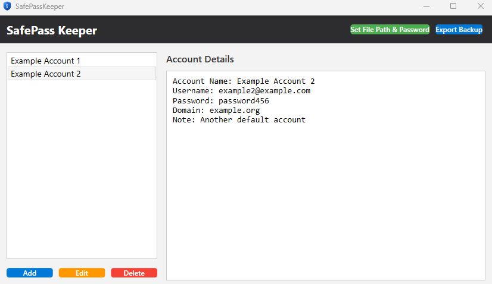
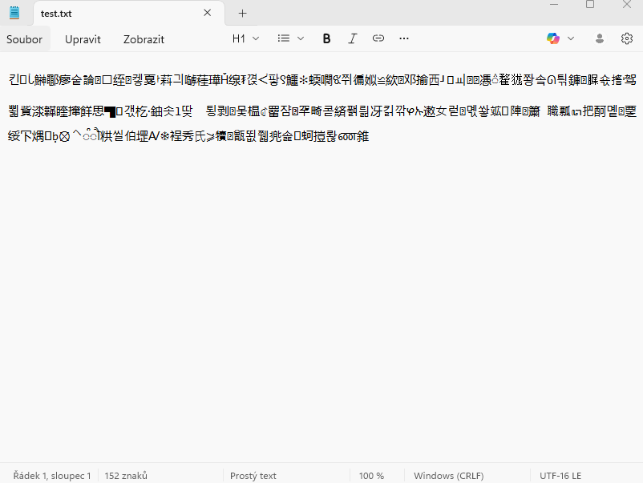

SafePassKeeper
SafePassKeeper is a straightforward password manager designed to securely store passwords using AES encryption. It offers a simple yet effective method to manage and protect your passwords.
Features
AES Encryption: Uses the AES algorithm to encrypt passwords, ensuring that your sensitive information is securely protected.
User-Friendly Interface: Provides an easy-to-use interface for adding, retrieving, and managing your passwords.
How to Use

